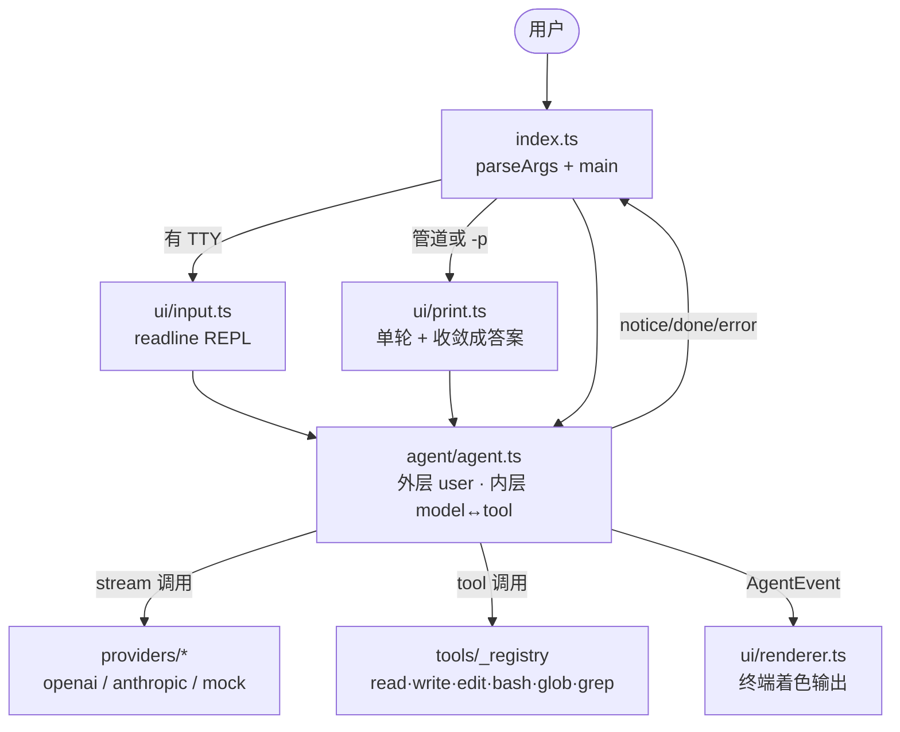
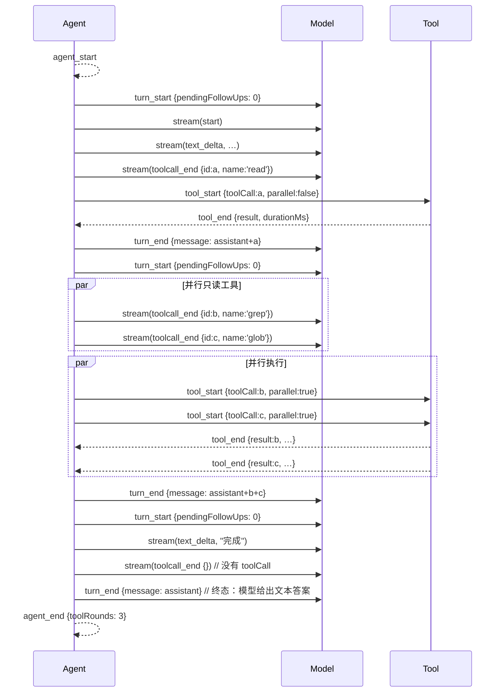
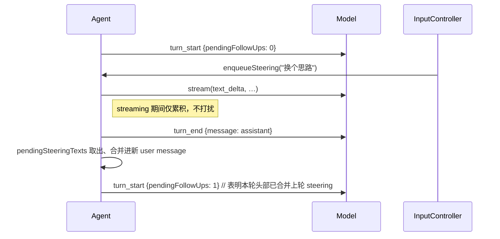

# AGENTS.md

给编码代理看的仓库约定。动手改代码前先读完，能省掉大部分返工。

## 这是什么

一个用 TypeScript 写的终端编码代理：外层循环处理一轮轮用户请求，内层循环处理当前请求里
「模型 ↔ 工具」的多轮往返。模型接口与厂商无关（OpenAI / Anthropic / mock 三个适配器收敛成
同一个 `StreamFn`），工具可插拔。

架构细节、工具清单、上下文管理策略见 [README.md](README.md)。

## 项目结构

### 数据流（外层 ↔ 内层）



### 文件树（已排除 node_modules / dist / .workbuddy / *.log / .DS_Store）

```
g/
├── AGENTS.md           本文件：仓库约定、扩展流程、已知坑
├── README.md           架构图、工具表、print 用法、扩展指引
├── package.json
├── tsconfig.json       strict + NodeNext + verbatimModuleSyntax
├── src/
│   ├── index.ts                CLI 入口，TTY / 管道 / -p 三路分发
│   ├── types.ts                全局共享类型（ModelRef / Message / TextContent）
│   ├── agent/                  唯一的调度状态机
│   │   ├── agent.ts              外层 enqueue + 内层 model↔tool 循环
│   │   ├── state.ts              messages / tools / usage 累计
│   │   ├── queue.ts              MessageQueue（中途指令合并）
│   │   ├── context.ts            transformContext：清理→压缩→裁剪
│   │   └── convert.ts            Anthropic ⇄ 内部消息互转
│   ├── providers/              模型适配器（缺 key 自动降级 mock）
│   │   ├── stream.ts             StreamAccumulator（流式 → 完整消息）
│   │   ├── types.ts              StreamEvent / StreamFn / JsonSchema
│   │   ├── openai.ts             OpenAI 兼容，BASE_URL 可覆写
│   │   ├── anthropic.ts          Anthropic API
│   │   ├── mock.ts               离线测试与 print 模式
│   │   └── index.ts              resolveModel + providers 表
│   ├── tools/                  6 个内置工具
│   │   ├── types.ts              Tool 接口 + ok() / fail()
│   │   ├── validate.ts           JSON Schema 参数校验
│   │   ├── fs-utils.ts           resolvePath / truncateText / 跳过隐藏目录
│   │   ├── glob-matcher.ts       glob 模式 → 正则
│   │   ├── read.ts
│   │   ├── write.ts
│   │   ├── edit.ts
│   │   ├── bash.ts               超时 + 输出截断（默认 120s/100K 字符）
│   │   ├── glob.ts               走 fs-utils 的 walk
│   │   ├── grep.ts               ripgrep 后端
│   │   └── index.ts              TOOL_REGISTRY + ToolName 派生源
│   └── ui/                     终端交互
│       ├── input.ts              InputController（readline + ctrl-c）
│       ├── renderer.ts           AgentEvent → 终端着色
│       └── print.ts              -p / 管道 / 缺 TTY 走这条
└── tests/
    └── run.ts                零依赖运行器，当前 31 个用例
```

### 各目录一行职责

- **index.ts** — 解析 CLI 参数，决定走交互 REPL、print 单轮还是 help
- **agent/** — 项目的核心；外层等用户输入，内层跑模型 ↔ 工具直到模型给出终态
- **providers/** — 把各家厂商的流式协议收敛成同一个 `StreamFn`，加供应商只需在这里挂一份
- **tools/** — 6 个内置工具的注册与共享辅助
- **ui/** — 渲染器只读 `AgentEvent`，不知道「模型」或「工具」是谁
- **tests/run.ts** — 端到端 + 单元 + 边界，靠 `node:assert/strict`，无第三方依赖
## 会话运行时

这一节讲清三件事：c-agent 跑一次请求时**事件流**怎么走、**中途插话**如何合并进上下文、
**transformContext** 怎么做后处理。然后讲**会话的概念视图是一棵树**，并诚实标出当前实现
与这种树状语义的差距。

### 事件清单

`AgentEvent` 是 11 种事件的判别联合（`src/agent/agent.ts:24-39`），订阅者按 `type` 分发：

| type | 何时发出 | 关键字段 | 订阅者常做的事 |
| --- | --- | --- | --- |
| `agent_start` | 外层循环入口 | — | 打印横幅、记录起始时间 |
| `turn_start` | 内层每个 user 轮开始 | `pendingFollowUps: number` | 提示「正在思考」；>0 表明本轮开头合并了上轮 steering |
| `steering` | 模型流期间被中途插入文本 | `texts: string[]` | 累积下来；只用于日志/UI，无业务动作 |
| `stream` | 模型流式增量 | `event: StreamEvent` | 转发厂商事件（`start` / `text_delta` / `thinking_delta` / `toolcall_delta` / `toolcall_end` / `done` / `error`） |
| `tool_start` | 工具执行前 | `toolCall`, `parallel: boolean` | 渲染 `→ bash(command=…)` 之类；`parallel` 区分两类并发模式 |
| `tool_end` | 工具完成后 | `toolCall`, `result`, `durationMs` | 渲染 `✓ bash 36ms`；失败时切换错误样式 |
| `turn_end` | 内层一轮结束 | `message: AssistantMessage` | 落账到 `state.messages`，可记 token 用量 |
| `context_pruned` | `transformContext` 三步任一步生效时 | `droppedMessages`, `prunedToolResults` | 渲染「已清理 N 条/压缩 M 条」 |
| `notice` | 非致命但需告知 | `message` | 显示降级提示、超出工具调用上限、模型流错误等 |
| `agent_end` | 整轮退出 | `toolRounds` | 打印 token 累计、释放资源、退出 REPL |

### 典型一次回合

一次无中途插话、有工具往返 + 一次并行的回合，事件流：



### 中途插话（steering）

用户在交互模式里、模型正跑的时候按键回车 —— 文本进 `MessageQueue.pendingSteeringTexts`。
模型本轮结束 → 内层循环退出 → 下一轮 `turn_start` 处合并 steering：



`pendingFollowUps` 是关键：如果它 `>0`，本轮结束时不算「终态」，内层循环会再跑一轮直到归 0。

### `transformContext` 三步后处理

每轮 `turn_end` 之后、内层循环继续前调 `transformContext(state.messages, transformOptions)`。
三步顺序敏感（`src/agent/context.ts`）：

1. **清理孤儿**：删除没有对应 `toolCall.id` 的 `toolResult`（异常流中断会留下）
2. **压缩旧轮次**：保留深度之外的旧轮被摘要替换（默认保留深度很小，几乎全丢，只留骨架）
3. **按预算整轮丢弃**：tokens 仍超限时，按整轮从最早的开始丢，直到 ≤ 预算

每一步都会发 `context_pruned` 事件，UI 实时可见清理进度。

### 工具并发与失败止损

**并发规则**（`agent.ts:executeToolCalls`）：

- `allowParallelTools && 全部 isMutating === false` → `Promise.all(...)` 并发
- 任一 mutating → 串行顺序 await
- `bash` / `write` / `edit` 标 `true`（会改状态），`read` / `glob` / `grep` 标 `false`（纯只读）

**失败止损**：

- 工具 `execute()` 不 `throw`；用 `ok()` / `fail()` 返回（异常由 `agent.ts` 兜底转 `fail`）
- 同一工具连续 3 次失败 → `failureCounts` 满 → 发 `notice: '工具 X 连续 3 次失败，已中止内层循环'` → 内层 break
- 外层 `maxToolRounds` 默认 50：超出发 `notice` 并退出；异常流用 `notice + 降级提示`，绝不崩溃

### 概念视图：会话是一棵树

事件流是**实现侧**的描述（消息如何进 `state.messages`）。从**用户视角**看，
会话其实可以更自然地视作一棵树：

```
Root                          ← 会话起点（隐含，不一定是 user #1）
│
▼ parent
User #1
│
▼
Assistant #1
│
▼
User #3
│
▼
Assistant #3
│
┌──────┴──────┐
▼              ▼
Branch A       Branch B       ← 用户中途分叉「试另一种思路」
│              │
▼              ▼
User #4-A      User #4-B
│              │
▼              ▼
Assistant #4-A Assistant #4-B
│
▼
Tool Call #2
│
▼
★ Current Node               ← ★ 是模型的「接续焦点」
```

- 每个节点 = 一条 `Message`，**携带 `parent` 指针**指向上一个节点
- `★ Current Node` 是「LLM 下次接手写的位置」
- `★` 推进规则：

  | 事件 | `★` 推进到 |
  | --- | --- |
  | 工具结果回填 | 该 `toolResult` 节点 |
  | 用户在交互模式中途插话 | 新追加的 `user` 节点 |
  | 模型生成新的 `assistant`  | 该 `assistant` 节点 |
  | 用户在分支间切换 | 目标分支末端 |
  | 模型要在当前位置接续 | 在 `★` 下新增子节点（成为新的 `★`） |

**反向遍历得到线性序列**：LLM 准备生成下一条消息前，从 `★` 沿 `parent` 走到 `Root`，拿到
一条**线性历史**，这就是模型真正看到的上下文。整棵树对模型不可见，它只看这条路径。

```
★ Current Node
│ ← parent
Tool Result #2
│
▼
Tool Call #2
│
▼
Assistant #4-A
│
▼
User #4-A
│
▼
Branch A
│
▼
Assistant #3   ← 一直走到 Root 才停
```

拿到的线性序列等价于：

```
User #1 → Assistant #1 → User #3 → Assistant #3
       → User #4-A → Assistant #4-A → Tool Call #2 → Tool Result #2
       → (LLM 从此处接续，预期产出 Assistant #5-A)
```

拿到序列后，才能进上一节的 `transformContext` 三步后处理。

### 当前实现 vs 树状语义

| 设计语义 | c-agent 当前实现 |
| --- | --- |
| 每条消息带 `parent` 指针 | ✅ `MessageNode { id, parent, children, message }` 存于 `state.nodes` |
| `★ Current Node` 概念 | ✅ `state.currentNodeId`；所有写入（user / assistant / toolResult）都推进到新节点 |
| 分支（Branch A / B）并存 | ⚠️ 数据层 OK（`addNodeAt` + `switchTo`），但 UI 未暴露——steering 仍合并成 user 消息 |
| LLM 看到的 = `★ → Root` 线性序列 | ✅ `transformContext` 用 `activeBranch(state)` 而不是 `state.messages` |
| 反向遍历 | ✅ `pathToRoot(state, id)` 带环检测，坏 id 返回 `[]` |

**诚实结论**：当前 c-agent 用 `messages[]` 数组**近似**这个树，能跑通所有内置功能，
但**不支持**树状语义才有的能力——分支探索、回退重放、上下文切片、跨分支对比。
要做到真的「会话是一棵树」，重构点是 `state.ts`（`messages: Message[]` → `nodes:
Map<id, MessageNode>` + `parent: id`）+ `agent.ts` 的写入路径跟着改，并让 `transformContext`
输入从线性数组改成反向遍历的产物。这是更大的工程，独立 PR 比较安全。

## 常用命令

| 命令 | 作用 |
| --- | --- |
| `npm install` | 装依赖 |
| `npm start` | 交互模式（无 API key 时自动降级到 mock） |
| `npm run typecheck` | `tsc --noEmit`，不产出文件 |
| `npm test` | 跑 `tests/run.ts`，零依赖测试运行器 |
| `npm run build` | 编译到 `dist/` |

**提交前必跑：`npm run typecheck && npm test`。** 两个都干净才算改完。

## 代码约定

- **TypeScript strict 全开**，含 `noUnusedLocals`、`noUnusedParameters`、`noFallthroughCasesInSwitch`、
  `noImplicitOverride`。声明了不用的变量/参数会直接编译失败 —— 不要留占位变量。
- **ESM + NodeNext**：相对导入必须写 `.js` 后缀，哪怕源文件是 `.ts`。
  `import { Agent } from "../agent/agent.js";` 才对，写 `../agent/agent` 会报错。
- **`verbatimModuleSyntax: true`**：类型导入必须显式 `import type { ... }`，
  类型再导出用 `export type { ... }`。不能拿普通 `import` 混着导入类型。
- **`switch` 每个 case 都要 `break` / `return`**，不允许贯穿（除非有意且写注释的空 case）。
- **工具不要 `throw`**，用 `src/tools/types.ts` 里的 `ok(text)` / `fail(text)` 返回 `ToolResult`。
  抛异常由 `agent.ts` 统一兜底转成 `fail`。
- **用命名导出**，不用 default。需要 barrel 的目录（`tools/`、`providers/`）放 `index.ts`。
- **文件头写一段中文 JSDoc**，说明这个文件在流程图里负责哪一块。
- **面向用户的文案用简体中文**（UI 输出、错误提示、README、本文件）。

## 加一个工具

1. 在 `src/tools/` 下新建文件，实现 `Tool` 接口：

   ```ts
   import { ok, type Tool } from "./types.js";

   export const fooTool: Tool = {
     name: "foo",
     description: "一句话说清干什么，会作为提示词发给模型。",
     parameters: { type: "object", properties: { /* JsonSchema */ }, required: [] },
     isMutating: false,          // 会改文件/外部状态就写 true
     async execute(args, ctx) {  // ctx: { cwd, signal }
       return ok("结果文本");
     },
   };
   ```

2. 注册进 `src/tools/index.ts` 的 `_registry` 对象（**不是数组**，单源真相是 `_registry`）。

   ```ts
   const _registry = {
     read: readTool,
     write: writeTool,
     edit: editTool,
     bash: bashTool,
     glob: globTool,
     grep: grepTool,
     foo: fooTool,   // ← 这里加一行
   } as const;
   ```

   `ToolName` 联合从 `_registry` 自动派生（`keyof typeof _registry`）。
   `findTool(name: ToolName)` 的参数因此编译期收紧——拼错立刻报错。
   `_registry` 顶部还有 `_AllAreTools` 类型断言，确保每个值 implements `Tool`。

`isMutating` 很关键：一批调用里只要有一个是 `true`，整批就退回串行执行。
只读工具标成 `true` 会白白牺牲并行，会改文件的标成 `false` 则可能并发写坏东西。

## 临时禁用某些工具

`AgentOptions.disabledTools?: ToolName[]` 接受一个名字数组，模型调用这些工具时会收到「已被禁用」错误（不会真的执行），可用工具列表里也会被剔除。常用于：让代理只读（`["write", "edit", "bash"]`）、强制只走 shell（`["write", "edit"]`）。

## 单次工具结果截断

`AgentOptions.maxToolResultChars?: number`（默认 50 000）：单条工具返回文本超过这个上限会被按头/尾截断，写入消息前完成。这与 `transformContext` 里的 `maxToolResultChars` 是不同机制——前者管「新写入」，后者管「旧轮次裁剪」。

## 加一个模型供应商

1. 在 `src/providers/` 下实现 `StreamFn`：一个产出 `StreamEvent`
   （`start` / `text_delta` / `thinking_delta` / `toolcall_delta` / `toolcall_end` / `done` / `error`）
   的异步生成器，用 `providers/stream.ts` 的 `StreamAccumulator` 累积出完整消息。
2. 在 `providers/index.ts` 的 `providers` 表里登记。
3. 把新的 id 加进 `src/types.ts` 的 `ProviderId` 联合类型。

缺 API key 时不要抛错 —— 现有的约定是降级到 mock 并在 `resolved.degraded` 里写明原因，
保证任何环境都能启动。

## 测试

`tests/run.ts` 是自带的零依赖运行器，用 `tsx` 跑，没有 jest/vitest。

```ts
test("用一句话说明验证什么", async () => {
  assert.equal(actual, expected);   // node:assert/strict
});
```

已有辅助：`runAgent({ cwd, prompt, stream?, tools?, allowParallelTools? })` 跑一遍完整代理，
返回 `{ events, messages, durationMs }`；`textOnly(text)` 造纯文本助手消息；
`tempDir()` 开临时目录。

端到端测试用 `createMockStream({ delayMs: 0 })`，不依赖网络也不需要 API key。

## 提示词覆盖（CLI 注入）

`createInitialState` 支持三个可选字段，CLI 把它们映射到四个标志：

| `createInitialState` 字段 | CLI 标志 | 作用 |
| --- | --- | --- |
| `systemPrompt` | `--system-prompt` / `-sp` | 完全替换 `buildSystemPrompt()` 的默认输出 |
| `appendSystemPrompt` | `--append-system-prompt` / `-asp` | 在默认系统提示词末尾追加 `# 追加指令` 段；空字符串等同未传 |
| `seedMessages` | `--user-prompt` / `-up` + `--assistant-prompt` / `-ap` | 在会话树最前面按序注入种子消息（`role: "user"` 或 `role: "assistant"`） |

`state.systemPrompt: string` 始终是「最终拼好的串」——base + 可选 append 段。`appendNode` 在 init 时跑完 `seedMessages` 里的每条，所以后续 `agent.run()` 看到的就是含种子的树。

`--assistant-prompt`（prefill）的语义：跟在 user 消息之后注入，模型会从这里接续。CLI 在 prefill 之后会自动追加一条用户消息 `[c-agent prefill] 请基于上一条助手消息继续。` 触发接续轮次；所以 `--assistant-prompt` 不允许单独使用——必须配合 `--user-prompt`。

## 注意事项 / 已知的坑

- **`src/index.ts` 在模块作用域直接调用 `main()`**，从测试里 import 它会把 CLI 跑起来。
  想测 CLI 相关的逻辑，抽到独立模块（参考 `src/ui/print.ts` 就是这么拆出来的）。
- **交互模式没法用管道测。** stdin 不是终端时会自动走 print 模式，管道进去的内容
  变成一次性提示词而不是 REPL 输入。要验证 REPL 得造伪终端：

  ```bash
  { sleep 1; printf '/verbose\n'; sleep 3; printf '运行 echo hi\n'; sleep 7; printf '/exit\n'; sleep 2; } \
    | script -q /tmp/tty.log npm start --silent -- --model mock
  ```

  输入必须逐行加 3 秒以上间隔。`script` 一次灌进多行会撞上 `InputController` 的竞态 ——
  waiter 为 null 时到达的行会掉进 steering 缓冲区，被当成「中途插入指令」而不是新请求，最终丢失。
  这是既有行为，真人打字速度碰不到，暂未处理。
- **别破坏 `assistant` 与 `toolResult` 的配对。** `transformContext()` 按 `toolCall.id`
  清理孤儿工具结果、按整轮丢弃上下文，都依赖这个结构。改 `agent.ts` 写回消息的部分要特别小心。
- **不要提交** `.env`、`node_modules/`、`dist/`、`*.log`、`.DS_Store`（已在 `.gitignore`）。
  配置样例放 `.env.example`。
