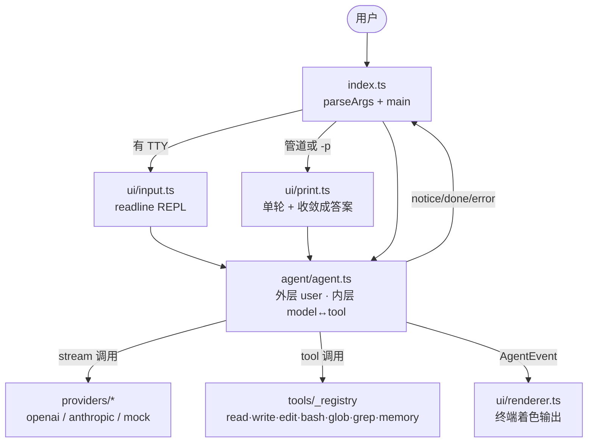
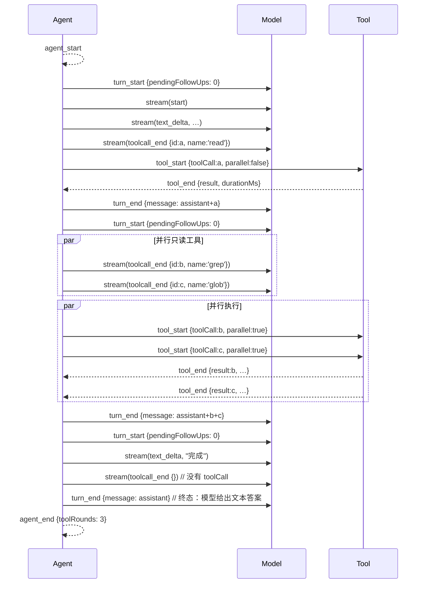
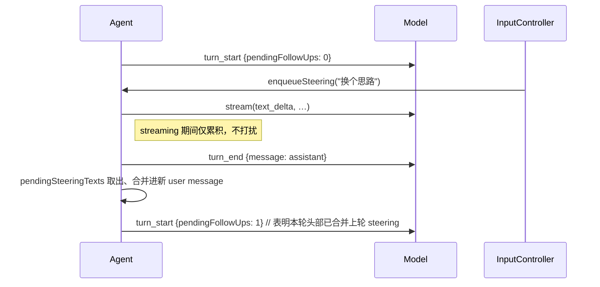

# AGENTS.md

给编码代理看的仓库约定。动手改代码前先读完，能省掉大部分返工。

## Computer Use
如果特斯拉可以使用视觉方案实现自动驾驶，那么Computer Use也可以使用视觉方案实现自动操作电脑。
1. 寻找时候有mcp cli api skill 等开源的方式可以操作应用 
2. 寻找是否有浏览器端可以使用Browser Use可以去操作
3. 使用 Computer Use操作应用
这条愿景的落地形态是**一条独立的工具通道**，不是替换现有工具：

- **分层原则**：文本通道优先（read/write/edit/bash 等——token 便宜、可回滚、可检索）；
  视觉通道兜底，只在「没有文本入口的场景」启用：桌面 GUI 应用、无 CLI 的软件、
  用户要求"帮我点这里/自动操作这个软件"。UI-TARS-2 技术报告同样把「纯 GUI 不够用、
  要接文件系统和终端」列为核心设计——两条通道是互补，不是二选一。
- **感知端 `screenshot`**（只读）：截屏返回 JPEG 图片 + 尺寸。
  坐标语义：模型看到的截图左上角为 `(0,0)`，harness 不做任何坐标换算。
- **执行端 `computer`**（mutating）：click / doubleClick / rightClick / type / hotkey /
  scroll 六个动作，坐标必须来自最近一次 screenshot。两端实现均零 npm 依赖：
  - Windows：PowerShell + System.Drawing / user32 P/Invoke；截多显示器并集，
    图片坐标加虚拟屏原点换算成物理像素，`SetProcessDPIAware` 保证高 DPI 一致。
  - macOS（`src/tools/darwin-cu.ts`）：`screencapture` 截主显示器 + `osascript`
    JXA ObjC bridge 发 CGEvent。Retina 截图在 screenshot 端就降采样到逻辑点尺寸，
    图片像素 == CGEvent 全局坐标，执行端零换算。MVP 只覆盖主显示器。
    需要 TCC 权限：屏幕录制（screencapture 无权限 exit≠0）+ 辅助功能
    （CGEventPost 被静默丢弃）——缺权限时工具 fail 并给出「系统设置」路径，
    绝不静默降级（JXA 直截 CGDisplayCreateImage 无权限会拿到只有壁纸的图，
    有意不用这条路截屏，只用 screencapture 的退出码当权限探测）。
- **Permission**：`computer` 改变真实桌面状态且**没有 git 回滚**——桌面端必须过
  `approvalGate`；CLI 无审批门，靠动作留痕 + 屏幕变化可见兜底。这是五支柱里
  「不可逆操作过人」的直接案例，不要为了"流畅"给它开后门。
- **Context 成本**：一张截图约 1.5K token。`transformContext` 压缩旧轮次时会把
  历史截图替换成占位文本（需要时重新 screenshot）——这是有意行为，不要"修复"它。
- **坐标算法基准**：若未来接入 UI-TARS 系模型（其输出在 smart_resize 坐标系，
  而非截图原始像素），坐标换算必须以对拍验证过的复刻实现为准（对拍 34/34：
  `.workbuddy/tmp/uitars/uitars-coords.ts` 对齐 `bytedance/UI-TARS`
  `codes/ui_tars/action_parser.py`；正式启用前迁入 `src/tools/` 并补单测）。
  三个坑：像素预算须与推理端一致、Python round 是银行家舍入、
  原版 `origin_resized_*` 参数实际要传原始分辨率。

## 这是什么

一个用 TypeScript 写的终端编码代理：外层循环处理一轮轮用户请求，内层循环处理当前请求里
「模型 ↔ 工具」的多轮往返。模型接口与厂商无关（OpenAI / Anthropic / Gemini /mock 三个适配器收敛成
同一个 `StreamFn`），工具可插拔。

架构细节、工具清单、上下文管理策略见 [README.md](README.md)。

## 设计哲学

如果模型越来越强大，哪些 agent 能力是可以消失的？

harness 里的每一段逻辑、每一条系统提示词规则，都应该拿这个问题过一遍：模型对齐变好后
会自然做对的事（比如「闲聊别调工具」这类规则），优先让给模型，而不是在代码里替它兜底。
加能力之前先问能不能少加——消失掉的代码就是最好的代码。

### 五支柱

评估任何设计或改动时，沿这 5 个维度过一遍。每根支柱都问同一个问题：
**这件事是 harness 的职责，还是模型变强后自己能做对？**

- **Model** — 模型本身的能力与配置。harness 只做「失败后调参」：重试
  （`AgentOptions.maxStreamRetries`）、失败驱动的 thinkingLevel 升档、按端点发
  `reasoning_effort`。不替模型决定怎么思考，也不在提示词里教它已经会的事。
- **Context** — 模型真正看到的那份上下文。会话树、`transformContext` 三步后处理、
  跨会话记忆注入（`collectProjectMemory`）、中途插话合并。问法：这条记忆/清理逻辑
  是不是模型自己能从上下文推断出来？能就不写代码，写进 memory 工具让它自己记。
- **Tool** — 工具的形状与观测质量。工具描述让模型一眼会用，执行结果给足续读线索
  （read 未读完的 offset 提示、二进制格式提示）。工具信息给得越好，兜底规则就越少。
- **Permission** — 什么必须过人。只拦「不可逆 / 灾难级」：`approvalGate`（mutating
  工具执行前回调）、bash 灾难命令护栏（`matchCatastrophicCommand`）。bash 本身标
  mutating，逐次审批时 `cat > file` 之类的绕行口同样过门，无暗道。边界：**审批是
  桌面端能力**，CLI（REPL/print）不接 approvalGate，靠灾难护栏兜底（终端场景逐条
  确认不现实）；桌面弹窗带 write/edit 的 `-/+` diff 预览（`desktop/main/approval-diff.ts`）。
  定位要诚实：**审批是知情同意机制，不是安全边界**——它防「犯错的
  模型」（真实运行态），防不了「存心绕的模型」；后者只能靠能力收缩（不给 bash /
  OS 沙箱 / 容器，Environment 支柱的事），在 harness 里堆反绕过正则是打不赢的
  军备竞赛，不加。更进一步：**代码本身就是通用逃逸通道**——审批看得到写了什么，
  看不到写下的东西之后会做什么（文本层审批 ≠ 行为层边界）。coding agent 的真边界
  只有执行环境：沙箱 / 容器 / 无网 / 只读挂载（Environment 支柱），加上 git 提供
  事后回滚。审批层只负责「提前知情」，不假装自己是边界。
- **Environment** — 模型对运行环境的感知与真边界，分三层。**感知**：事实给足不写
  规则——cwd、platform / Node、当前日期、shell（系统提示词），git 快照（branch +
  未提交文件数）；模型知道得越准，猜错越少，兜底规则越少。**可逆性**：git 承担
  事后回滚，是本机场景下实际最强的「权限」。**隔离**：沙箱 / 容器 / 无网是终极
  职责——等分发或跑不可信任务再上（与 Electron sandbox 同一决策模式），不在
  审批层补课。

用法：新增能力前先判断它落在哪根支柱、按消失之问是否真的需要存在，再动手。

## 项目结构

### 数据流（外层 ↔ 内层）



### 文件树（已排除 node_modules / dist / .workbuddy / *.log / .DS_Store）

```
g/
├── AGENTS.md           本文件：仓库约定、扩展流程、已知坑
├── README.md           架构图、工具表、print 用法、扩展指引
├── package.json
├── tsconfig.json       strict + NodeNext + verbatimModuleSyntax
├── src/
│   ├── index.ts                CLI 入口，TTY / 管道 / -p 三路分发
│   ├── types.ts                全局共享类型（ModelRef / Message / TextContent）
│   ├── agent/                  唯一的调度状态机
│   │   ├── agent.ts              外层 enqueue + 内层 model↔tool 循环
│   │   ├── convert.ts            Anthropic ⇄ 内部消息互转
│   │   └── doc/                  子模块文档（README.md）
│   ├── context/                模型真正看到的那份上下文
│   │   ├── index.ts              统一出口，引用方只认这里
│   │   ├── state.ts              会话状态 + 会话树（节点 / ★ / 分支）、token 与 usage
│   │   ├── transform.ts          transformContext：清理→压缩→裁剪
│   │   ├── queue.ts              MessageQueue（中途指令合并）
│   │   ├── sessions.ts           会话持久化（.c-agent/sessions/<id>.json，--resume 还原）
│   │   └── doc/                  子模块文档（README.md）
│   ├── providers/              模型适配器（缺 key 自动降级 mock）
│   │   ├── stream.ts             StreamAccumulator（流式 → 完整消息）
│   │   ├── types.ts              StreamEvent / StreamFn / JsonSchema
│   │   ├── openai.ts             OpenAI 兼容，BASE_URL 可覆写
│   │   ├── anthropic.ts          Anthropic API
│   │   ├── mock.ts               离线测试与 print 模式
│   │   ├── index.ts              resolveModel + providers 表
│   │   └── doc/                  子模块文档（README.md）
│   ├── tools/                  10 个内置工具
│   │   ├── types.ts              Tool 接口 + ok() / fail() / okImage()
│   │   ├── validate.ts           JSON Schema 参数校验
│   │   ├── fs-utils.ts           resolvePath / truncateText / 跳过隐藏目录
│   │   ├── glob-matcher.ts       glob 模式 → 正则
│   │   ├── read.ts
│   │   ├── write.ts
│   │   ├── edit.ts
│   │   ├── bash.ts               超时 + 输出截断（默认 120s/100K 字符）
│   │   ├── glob.ts               走 fs-utils 的 walk
│   │   ├── grep.ts               ripgrep 后端
│   │   ├── memory.ts             跨会话记忆（追加式存储，写入项目根 MEMORY.md）
│   │   ├── darwin-cu.ts          macOS Computer Use 后端：screencapture + JXA/CGEvent
│   │   ├── screenshot.ts         Computer Use 感知端：截屏 → JPEG（Windows/macOS）
│   │   ├── computer.ts           Computer Use 执行端：鼠标/键盘/滚轮（Windows/macOS）
│   │   ├── ask-user.ts           模型 → 用户提问通道（端点经 setAskUserHandler 注入实现）
│   │   ├── index.ts              TOOL_REGISTRY + ToolName 派生源
│   │   └── doc/                  子模块文档（README.md）
│   ├── ui/                     终端交互
│   │   ├── input.ts              InputController（readline + ctrl-c）
│   │   ├── renderer.ts           AgentEvent → 终端着色
│   │   ├── markdown.ts           Markdown → ANSI（流式按行攒 + 一次性渲染）
│   │   ├── print.ts              -p / 管道 / 缺 TTY 走这条
│   │   └── doc/                  子模块文档（README.md）
│   ├── log/                    文件日志
│   │   ├── logger.ts             分级日志 → .c-agent/logs/（按天一份、绝不抛错）
│   │   ├── index.ts              统一出口（引用方只认这里）
│   │   └── doc/                  子模块文档（README.md）
│   └── doc/                    src/ 全局文档（README.md：数据流图 + 约定）
└── tests/
    ├── run.ts                入口：编排 + 直接 import 内部模块的单元/集成测试（48）
    ├── registry.ts           用例注册中心（test / main / sleep / stripAnsi）
    ├── manual.ts             ManualSession：spawn 真子进程 + in-process FakeInput
    ├── cli-print.ts          spawn 真 c-agent 跑 print 模式的端到端用例（21）
    └── repl-loop.ts          in-process REPL 循环用例，FakeInput 驱动（17）
```

### 各目录一行职责

- **index.ts** — 解析 CLI 参数，决定走交互 REPL、print 单轮还是 help
- **agent/** — 项目的核心；外层等用户输入，内层跑模型 ↔ 工具直到模型给出终态
- **context/** — 上下文的全部实现：会话树存储、系统提示词、token 估算、交给模型前的三步后处理、消息入队
- **providers/** — 把各家厂商的流式协议收敛成同一个 `StreamFn`，加供应商只需在这里挂一份
- **tools/** — 10 个内置工具的注册与共享辅助；memory 工具承担跨会话记忆的写入端，ask_user 工具承担模型 → 用户提问（答案作为 toolResult 回灌）
- **ui/** — 渲染器只读 `AgentEvent`，不知道「模型」或「工具」是谁
- **ui/markdown.ts** — 唯一知道 ANSI 转义序列的地方；`enabled: false` 时纯透传
- **tests/run.ts** — 入口编排 + 直接 import 内部模块的单元 / 集成测试，最快的那批
- **tests/registry.ts** — 用例注册中心，子用例文件 `import { test } from "./registry.js"` 自注册
- **tests/manual.ts** — `ManualSession`：spawn 真子进程做 CLI 测试，或 in-process + `FakeInput` 做 REPL 测试
- **tests/cli-print.ts / tests/repl-loop.ts** — 子用例文件，分别覆盖 print 模式子进程 + in-process REPL 循环

## 会话运行时

这一节讲清三件事：c-agent 跑一次请求时**事件流**怎么走、**中途插话**如何合并进上下文、
**transformContext** 怎么做后处理。然后讲**会话的概念视图是一棵树**，并诚实标出当前实现
与这种树状语义的差距。

### 事件清单

`AgentEvent` 是 11 种事件的判别联合（`src/agent/agent.ts:24-39`），订阅者按 `type` 分发：

| type | 何时发出 | 关键字段 | 订阅者常做的事 |
| --- | --- | --- | --- |
| `agent_start` | 外层循环入口 | — | 打印横幅、记录起始时间 |
| `turn_start` | 内层每个 user 轮开始 | `pendingFollowUps: number` | 提示「正在思考」；>0 表明本轮开头合并了上轮 steering |
| `steering` | 模型流期间被中途插入文本 | `texts: string[]` | 累积下来；只用于日志/UI，无业务动作 |
| `stream` | 模型流式增量 | `event: StreamEvent` | 转发厂商事件（`start` / `text_delta` / `thinking_delta` / `toolcall_delta` / `toolcall_end` / `done` / `error`） |
| `tool_start` | 工具执行前 | `toolCall`, `parallel: boolean` | 渲染 `→ bash(command=…)` 之类；`parallel` 区分两类并发模式 |
| `tool_end` | 工具完成后 | `toolCall`, `result`, `durationMs` | 渲染 `✓ bash 36ms`；失败时切换错误样式 |
| `turn_end` | 内层一轮结束 | `message: AssistantMessage` | 落账到 `state.messages`，可记 token 用量 |
| `context_pruned` | `transformContext` 三步任一步生效时 | `droppedMessages`, `prunedToolResults` | 渲染「已清理 N 条/压缩 M 条」 |
| `notice` | 非致命但需告知 | `message` | 显示降级提示、超出工具调用上限、模型流错误等 |
| `agent_end` | 整轮退出 | `toolRounds` | 打印 token 累计、释放资源、退出 REPL |

### 典型一次回合

一次无中途插话、有工具往返 + 一次并行的回合，事件流：



### 中途插话（steering）

用户在交互模式里、模型正跑的时候按键回车 —— 文本进 `MessageQueue.pendingSteeringTexts`。
模型本轮结束 → 内层循环退出 → 下一轮 `turn_start` 处合并 steering：



`pendingFollowUps` 是关键：如果它 `>0`，本轮结束时不算「终态」，内层循环会再跑一轮直到归 0。

**串行工具间隙的打断**（借鉴 badlogic/pi-mono）：steering 在串行执行工具的**间隙**也会被
检查——发现插话就立即停手，剩余调用标 skipped（isError 结果「用户发来了新指令，本次
工具调用已跳过」）回给模型。下一轮模型同时看到「已执行的结果 + 被跳过的调用 + 用户
插话」，能马上调整方向，而不是干等所有工具跑完。两条纪律：

- 打断检查只**偷看**队列（`hasSteering()`）不取，注入仍由内层循环顶部统一做——保证
  `toolResult` 紧跟 `assistant(toolCalls)` 的消息顺序不破（OpenAI/Anthropic 都要求这个顺序）。
- skipped 的结果不进重复失败计数、不参与动态推理强度升降档——用户打断不是模型的失败。

### `transformContext` 三步后处理

每轮 `turn_end` 之后、内层循环继续前调 `transformContext(state.messages, transformOptions)`。
三步顺序敏感（`src/context/transform.ts`）：

1. **清理孤儿**：删除没有对应 `toolCall.id` 的 `toolResult`（异常流中断会留下）
2. **压缩旧轮次**：保留深度之外的旧轮被摘要替换（默认保留深度很小，几乎全丢，只留骨架）
3. **按预算整轮丢弃**：tokens 仍超限时，按整轮从最早的开始丢，直到 ≤ 预算

每一步都会发 `context_pruned` 事件，UI 实时可见清理进度。

### 工具并发与失败止损

**并发规则**（`agent.ts:executeToolCalls`）：

- `allowParallelTools && 全部 isMutating === false` → `Promise.all(...)` 并发
- 任一 mutating → 串行顺序 await
- `bash` / `write` / `edit` 标 `true`（会改状态），`read` / `glob` / `grep` 标 `false`（纯只读）

**失败止损**：

- 工具 `execute()` 不 `throw`；用 `ok()` / `fail()` 返回（异常由 `agent.ts` 兜底转 `fail`）
- 同一工具连续 3 次失败 → `failureCounts` 满 → 发 `notice: '工具 X 连续 3 次失败，已中止内层循环'` → 内层 break
- 外层 `maxToolRounds` 默认 50：超出发 `notice` 并退出；异常流用 `notice + 降级提示`，绝不崩溃

### 概念视图：会话是一棵树

事件流是**实现侧**的描述（消息如何进 `state.messages`）。从**用户视角**看，
会话其实可以更自然地视作一棵树：

```
Root                          ← 会话起点（隐含，不一定是 user #1）
│
▼ parent
User #1
│
▼
Assistant #1
│
▼
User #3
│
▼
Assistant #3
│
┌──────┴──────┐
▼              ▼
Branch A       Branch B       ← 用户中途分叉「试另一种思路」
│              │
▼              ▼
User #4-A      User #4-B
│              │
▼              ▼
Assistant #4-A Assistant #4-B
│
▼
Tool Call #2
│
▼
★ Current Node               ← ★ 是模型的「接续焦点」
```

- 每个节点 = 一条 `Message`，**携带 `parent` 指针**指向上一个节点
- `★ Current Node` 是「LLM 下次接手写的位置」
- `★` 推进规则：

  | 事件 | `★` 推进到 |
  | --- | --- |
  | 工具结果回填 | 该 `toolResult` 节点 |
  | 用户在交互模式中途插话 | 新追加的 `user` 节点 |
  | 模型生成新的 `assistant`  | 该 `assistant` 节点 |
  | 用户在分支间切换 | 目标分支末端 |
  | 模型要在当前位置接续 | 在 `★` 下新增子节点（成为新的 `★`） |

**反向遍历得到线性序列**：LLM 准备生成下一条消息前，从 `★` 沿 `parent` 走到 `Root`，拿到
一条**线性历史**，这就是模型真正看到的上下文。整棵树对模型不可见，它只看这条路径。

```
★ Current Node
│ ← parent
Tool Result #2
│
▼
Tool Call #2
│
▼
Assistant #4-A
│
▼
User #4-A
│
▼
Branch A
│
▼
Assistant #3   ← 一直走到 Root 才停
```

拿到的线性序列等价于：

```
User #1 → Assistant #1 → User #3 → Assistant #3
       → User #4-A → Assistant #4-A → Tool Call #2 → Tool Result #2
       → (LLM 从此处接续，预期产出 Assistant #5-A)
```

拿到序列后，才能进上一节的 `transformContext` 三步后处理。

### 当前实现 vs 树状语义

| 设计语义 | c-agent 当前实现 |
| --- | --- |
| 每条消息带 `parent` 指针 | ✅ `MessageNode { id, parent, children, message }` 存于 `state.nodes` |
| `★ Current Node` 概念 | ✅ `state.currentNodeId`；所有写入（user / assistant / toolResult）都推进到新节点 |
| 分支（Branch A / B）并存 | ⚠️ 数据层 OK（`addNodeAt` + `switchTo`），但 UI 未暴露——steering 仍合并成 user 消息 |
| LLM 看到的 = `★ → Root` 线性序列 | ✅ `transformContext` 用 `activeBranch(state)` 而不是 `state.messages` |
| 反向遍历 | ✅ `pathToRoot(state, id)` 带环检测，坏 id 返回 `[]` |

**当前状态**：树的数据层已经落地 —— `nodes: Map<id, MessageNode>` + `★ currentNodeId`，
`transformContext` 的输入也换成了 `activeBranch(state)` 反向遍历的产物，不再是裸数组。

**还缺的是上层的树状能力**——分支探索、回退重放、上下文切片、跨分支对比。数据层
（`addNodeAt` / `switchTo`）已就绪，但 UI 与输入侧没暴露分支切换，steering 仍被合并成
一条 user 消息。要做这些能力，从 `src/context/state.ts` 的 `switchTo` 往上接 UI 即可，
不用再动数据层。

## 常用命令

| 命令 | 作用 |
| --- | --- |
| `npm install` | 装依赖 |
| `npm start` | 交互模式（无 API key 时自动降级到 mock） |
| `npm run typecheck` | `tsc --noEmit`，不产出文件 |
| `npm test` | 跑 `tests/run.ts`，零依赖运行器；当前 86 个用例（48 单元 / 21 CLI 子进程 / 17 in-process REPL） |
| `npm run build` | 编译到 `dist/` |

**提交前必跑：`npm run typecheck && npm test`。** 两个都干净才算改完。

## 代码约定

- **TypeScript strict 全开**，含 `noUnusedLocals`、`noUnusedParameters`、`noFallthroughCasesInSwitch`、
  `noImplicitOverride`。声明了不用的变量/参数会直接编译失败 —— 不要留占位变量。
- **ESM + NodeNext**：相对导入必须写 `.js` 后缀，哪怕源文件是 `.ts`。
  `import { Agent } from "../agent/agent.js";` 才对，写 `../agent/agent` 会报错。
- **`verbatimModuleSyntax: true`**：类型导入必须显式 `import type { ... }`，
  类型再导出用 `export type { ... }`。不能拿普通 `import` 混着导入类型。
- **`switch` 每个 case 都要 `break` / `return`**，不允许贯穿（除非有意且写注释的空 case）。
- **工具不要 `throw`**，用 `src/tools/types.ts` 里的 `ok(text)` / `fail(text)` 返回 `ToolResult`。
  抛异常由 `agent.ts` 统一兜底转成 `fail`。
- **用命名导出**，不用 default。需要 barrel 的目录（`tools/`、`providers/`）放 `index.ts`。
- **文件头写一段中文 JSDoc**，说明这个文件在流程图里负责哪一块。
- **面向用户的文案用简体中文**（UI 输出、错误提示、README、本文件）。
- **每个 `src/**` 子目录自带一份 `doc/README.md`**——把目录的职责、关键 API、协作边界、扩展指引、已知坑写进去。归档结构见上一节「文件树」，`src/doc/README.md` 是入口总览。改动目录职责、新增文件、删文件、改外部协作边界时**必须同步更新**对应 `doc/README.md`；结构无实质变化（改名/参数微调）可以只改文件树注释行。

## 加一个工具

1. 在 `src/tools/` 下新建文件，实现 `Tool` 接口：

   ```ts
   import { ok, type Tool } from "./types.js";

   export const fooTool: Tool = {
     name: "foo",
     description: "一句话说清干什么，会作为提示词发给模型。",
     parameters: { type: "object", properties: { /* JsonSchema */ }, required: [] },
     isMutating: false,          // 会改文件/外部状态就写 true
     async execute(args, ctx) {  // ctx: { cwd, signal }
       return ok("结果文本");
     },
   };
   ```

2. 注册进 `src/tools/index.ts` 的 `_registry` 对象（**不是数组**，单源真相是 `_registry`）。

   ```ts
   const _registry = {
     read: readTool,
     write: writeTool,
     edit: editTool,
     bash: bashTool,
     glob: globTool,
     grep: grepTool,
     foo: fooTool,   // ← 这里加一行
   } as const;
   ```

  `ToolName` 联合从 `_registry` 自动派生（`keyof typeof _registry`）。
  `_registry` 顶部还有 `_AllAreTools` 类型断言，确保每个值 implements `Tool`。

`isMutating` 很关键：一批调用里只要有一个是 `true`，整批就退回串行执行。
只读工具标成 `true` 会白白牺牲并行，会改文件的标成 `false` 则可能并发写坏东西。

## 临时禁用某些工具

`AgentOptions.disabledTools?: ToolName[]` 接受一个名字数组，模型调用这些工具时会收到「已被禁用」错误（不会真的执行），可用工具列表里也会被剔除。常用于：让代理只读（`["write", "edit", "bash"]`）、强制只走 shell（`["write", "edit"]`）。

## 单次工具结果截断

`AgentOptions.maxToolResultChars?: number`（默认 50 000）：单条工具返回文本超过这个上限会被按头/尾截断，写入消息前完成。这与 `transformContext` 里的 `maxToolResultChars` 是不同机制——前者管「新写入」，后者管「旧轮次裁剪」。

## 加一个模型供应商

1. 在 `src/providers/` 下实现 `StreamFn`：一个产出 `StreamEvent`
   （`start` / `text_delta` / `thinking_delta` / `toolcall_delta` / `toolcall_end` / `done` / `error`）
   的异步生成器，用 `providers/stream.ts` 的 `StreamAccumulator` 累积出完整消息。
2. 在 `providers/index.ts` 的 `providers` 表里登记。
3. 把新的 id 加进 `src/types.ts` 的 `ProviderId` 联合类型。

缺 API key 时不要抛错 —— 现有的约定是降级到 mock 并在 `resolved.degraded` 里写明原因，
保证任何环境都能启动。

## 测试

零依赖运行器（`node:assert/strict` + `tsx`），没有 jest/vitest。当前 86 个用例分三类：

| 文件 | 关注 | 用例数 |
| --- | --- | --- |
| `tests/run.ts` | import 内部模块测单元 / 集成 / 边界，最快 | 48 |
| `tests/cli-print.ts` | spawn 真 c-agent 跑 print 模式 | 21 |
| `tests/repl-loop.ts` | `FakeInput` 驱动 `src/ui/repl.ts` 的循环 | 17 |

子用例文件通过 `tests/registry.ts` 自注册——加新分类时新写一个 `.ts` 用 `import { test } from "./registry.js"`，再在 `tests/run.ts` 顶部加一行 import 即可。

### 直接单元 / 集成测试（最常用）

```ts
import { test, assert } from "./registry.js";

test("用一句话说明验证什么", async () => {
  assert.equal(actual, expected);
});
```

辅助：`runAgent({ cwd, prompt, stream?, tools?, allowParallelTools? })` 跑一遍完整代理，
返回 `{ events, messages, durationMs }`；`textOnly(text)` 造纯文本助手消息；
`tempDir()` 开临时目录。

端到端测试用 `createMockStream({ delayMs: 0 })`，不依赖网络也不需要 API key。

### 手动式自动化测试（CLI / REPL）

交互逻辑靠 TTY，而 `process.stdin.isTTY` 在子进程里永远是 `false`——管道或子进程 fork
出来的 stdio 一定进 print 模式，测不了 REPL。所以专门抽了两层：

**`src/ui/repl.ts`** 把 REPL 主循环从 `src/index.ts` 抽出来，吃 `LoopInput` 接口；
`InputController`（真终端 readline）和 `FakeInput`（测试）都实现这个接口。

**`tests/manual.ts`** 的 `ManualSession`：

- `ManualSession.spawn({...})` — 起真子进程跑 `tsx src/index.ts`，
  `.expect(substring)` / `.send(line)` / `.expectIdle()` 模拟按键 + 等待输出
- `ManualSession.inProcess({...})` — 不起子进程，用 `FakeInput` 驱动 `runRepl()`，
  agent 的 `text_delta` 通过 `pumpOutput()` 灌进 session

子用例样例（`tests/cli-print.ts`）：

```ts
test("print 模式：stdin 携带提示词，stdout 只输出答案", async () => {
  const s = await ManualSession.spawn({
    args: ["--model", "mock", "-p"],
    cwd: repoRoot,
    stdinPayload: "回我一句 ok",
  });
  await s.expect("ok", { timeoutMs: 30_000 });
  await s.expectExit(0);
});
```

子用例样例（`tests/repl-loop.ts`）：

```ts
test("REPL：/help 应打印可用命令", async () => {
  const s = ManualSession.inProcess({ cwd: repoRoot });
  await startRepl(s);              // 串好 onEvent / queue / FakeInput
  s.input.pushLine("/help");
  await s.expect("/help");
  s.input.pushEof();
  await s.expectExit(0);
});
```

子进程 spawn 时 `cleanEnv()` 会自动清空 `*_API_KEY` 和 `MODEL`，确保 mock 真的能跑；tsx loader
路径用 `createRequire(import.meta.url).resolve("tsx")` 拿绝对地址，避免子进程 cwd=/tmp 时
`Cannot find package 'tsx'`。

## 提示词覆盖（CLI 注入）

`createInitialState` 支持三个可选字段，CLI 把它们映射到四个标志：

| `createInitialState` 字段 | CLI 标志 | 作用 |
| --- | --- | --- |
| `systemPrompt` | `--system-prompt` / `-sp` | 完全替换 `buildSystemPrompt()` 的默认输出 |
| `appendSystemPrompt` | `--append-system-prompt` / `-asp` | 在默认系统提示词末尾追加 `# 追加指令` 段；空字符串等同未传 |
| `seedMessages` | `--user-prompt` / `-up` + `--assistant-prompt` / `-ap` | 在会话树最前面按序注入种子消息（`role: "user"` 或 `role: "assistant"`） |

`state.systemPrompt: string` 始终是「最终拼好的串」——base + 可选 append 段。`appendNode` 在 init 时跑完 `seedMessages` 里的每条，所以后续 `agent.run()` 看到的就是含种子的树。

`--assistant-prompt`（prefill）的语义：跟在 user 消息之后注入，模型会从这里接续。CLI 在 prefill 之后会自动追加一条用户消息，默认内容 `[c-agent prefill] 请基于上一条助手消息继续。`——这是为了让对话「突破 prefill 的死端」真正往前走。这条默认消息可通过 `--prefill-commit` / `-pc` 自定义：

- 不传：用 `DEFAULT_PREFILL_COMMIT` 默认接续消息
- 传任意非空文本：完整替换默认接续消息
- 传 `""`：**完全跳过**追加，模型会从 prefill 静默接续（适用场景：prefill 自身已经在引导对话）

`--assistant-prompt` 不允许单独使用——必须配合 `--user-prompt`，因为 prefill 必须跟在 user 之后。`DEFAULT_PREFILL_COMMIT` 常量在 `src/index.ts` 里导出，单测可直接断言。

## 终端 Markdown 渲染

模型输出是 Markdown 源码，`src/ui/markdown.ts` 负责把它转成终端样式。三条硬约束决定了实现形态：

**1. 只能在没有管道时开。** ANSI 转义序列一旦进了管道就是噪声（`| pbcopy` 会复制到一串 `\x1b[1m`）。
所以 `src/index.ts` 里是 `args.markdown && process.stdout.isTTY === true`——`--no-markdown` 和
非 TTY 输出都会落到 `enabled: false`，此时 `renderMarkdown()` / `push()` 都是**纯透传**，一个字节不多写。

**2. 流式必须按行攒。** 交互模式是 token 级增量，`**bo` 和 `ld**` 可能分在两个 delta 里到达。
逐 delta 渲染会把半个标记当成普通字符。所以 `createMarkdownStream()` 内部留一个行缓冲，
只有吃到 `\n` 才吐出整行的渲染结果；`end()` 负责冲出最后没有换行的半行。
`TerminalRenderer` 在每个**非** `stream` 事件前调 `flushText()`，否则工具调用行会插进一行文字中间。

**3. 不引第三方依赖。** 只做终端够用的子集：

| 语法 | 处理 |
| --- | --- |
| `#`~`######` 标题 | 去井号，h1/h2 加粗 + 洋红，其余只加粗 |
| `-` `*` `+` `1.` 列表、`>` 引用 | 保留标记字符，标记本身转暗色；引用前缀换成 `│` |
| `---` 分隔线 | 按终端列宽铺 `─` |
| 围栏 ``` / ~~~ | 整块暗色原样输出，**内部不做任何行内解析** |
| `**粗体**` `~~删除~~` `*斜体*` | 对应 ANSI；斜体只认 `*x*`，`_x_` 会把 `snake_case` 误判成强调 |
| `` `行内码` `` | 青色，先切出来再处理强调，避免内部被二次解析 |
| `[文字](链接)` | 文字青色 + 暗色地址 |

跨行状态只有 `fence` 一个（关栏需同字符且长度 ≥ 开栏）。不支持嵌套强调、`***x***`、表格、HTML——
这些要么罕见，要么在终端里没意义。

## 注意事项 / 已知的坑

- **`src/index.ts` 在模块作用域直接调用 `main()`**，从测试里 import 它会把 CLI 跑起来。
  想测 CLI 相关的逻辑，抽到独立模块（参考 `src/ui/print.ts` 就是这么拆出来的）。
- **交互模式没法用管道测。** stdin 不是终端时会自动走 print 模式，管道进去的内容
  变成一次性提示词而不是 REPL 输入。要验证 REPL 得造伪终端：

  ```bash
  { sleep 1; printf '/verbose\n'; sleep 3; printf '运行 echo hi\n'; sleep 7; printf '/exit\n'; sleep 2; } \
    | script -q /tmp/tty.log npm start --silent -- --model mock
  ```

  输入必须逐行加 3 秒以上间隔。`script` 一次灌进多行会撞上 `InputController` 的竞态 ——
  waiter 为 null 时到达的行会掉进 steering 缓冲区，被当成「中途插入指令」而不是新请求，最终丢失。
  这是既有行为，真人打字速度碰不到，暂未处理。
- **别破坏 `assistant` 与 `toolResult` 的配对。** `transformContext()` 按 `toolCall.id`
  清理孤儿工具结果、按整轮丢弃上下文，都依赖这个结构。改 `agent.ts` 写回消息的部分要特别小心。
- **不要提交** `.env`、`node_modules/`、`dist/`、`*.log`、`.DS_Store`（已在 `.gitignore`）。
  配置样例放 `.env.example`。
- **改了 `src/**` 的目录职责、协作边界、外部 API 时同步 `doc/README.md`**。`src/agent/` 加新事件 → `src/agent/doc/README.md` 的「事件清单」要补；`src/context/` 改 `transformContext` → `src/context/doc/README.md` 的三步图要重画；`src/providers/` 加供应商 → `src/providers/doc/README.md` 的差异表要补。约定见上「代码约定」一节。
