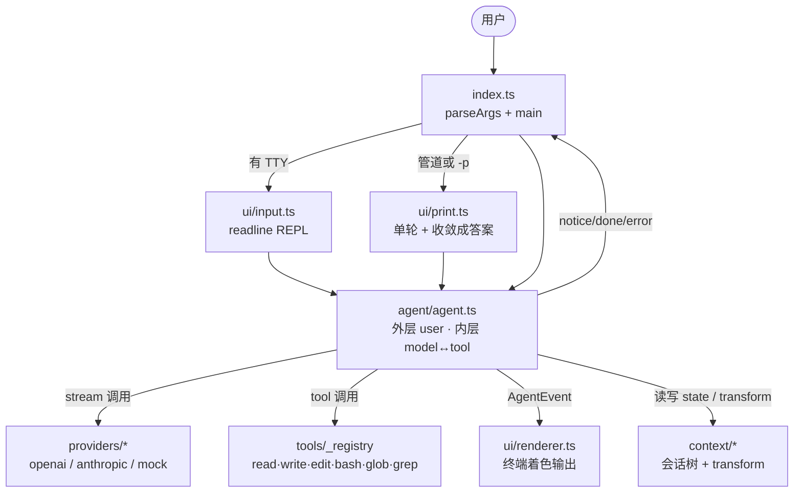

# src 目录总览

`src/` 是终端编码代理的源代码根目录。整个项目用 TypeScript（strict + NodeNext +
verbatimModuleSyntax）按职责切分成若干子模块，对外唯一入口是 [`index.ts`](../index.ts)
—— 它负责解析 CLI 参数并把控制权交给交互 REPL 或 print 单轮模式。

## 一句话总结

模型接口与厂商无关（OpenAI / Anthropic / mock 三个适配器收敛成同一个 `StreamFn`），
工具可插拔，外层循环处理一轮轮用户请求，内层循环处理「模型 ↔ 工具」的多轮往返。

## 子模块分工

| 子目录 | 关注点 | 关键文件 |
| --- | --- | --- |
| [`agent/`](./agent/doc/README.md) | 唯一的调度状态机：外层 user 队列、内层 model↔tool 循环、事件流定义、并发与失败止损 | `agent.ts`、`convert.ts` |
| [`context/`](./context/doc/README.md) | 模型真正看到的那份上下文：会话树、系统提示词、token 估算、消息入队、`transformContext` 三步后处理 | `state.ts`、`transform.ts`、`queue.ts`、`index.ts` |
| [`providers/`](./providers/doc/README.md) | 模型适配器：把 OpenAI / Anthropic / mock 的流式协议收敛成同一个 `StreamFn` | `openai.ts`、`anthropic.ts`、`mock.ts`、`stream.ts`、`types.ts`、`index.ts` |
| [`tools/`](./tools/doc/README.md) | 6 个内置工具（read / write / edit / bash / glob / grep）：注册表、参数校验、共享文件系统辅助 | `index.ts`、`types.ts`、`validate.ts`、`fs-utils.ts`、`*Tool.ts` |
| [`ui/`](./ui/doc/README.md) | 终端交互：REPL 输入控制器、AgentEvent 着色渲染器、Markdown → ANSI、print 模式收敛 | `input.ts`、`renderer.ts`、`markdown.ts`、`print.ts` |

## 数据流总图

## 约定

- **TypeScript 严格模式**，`tsconfig.json` 同时开启 `strict` 与 `verbatimModuleSyntax`，
  跨文件 import 必须带 `.js` 后缀（哪怕源文件是 `.ts`）。
- **`types.ts` 是全局共享类型**：`AgentMessage` / `AssistantMessage` / `ModelRef` /
  `ToolCallContent` 这类与「上下文」无关的纯数据形态都在仓库根 `src/types.ts`，由
  `agent/`、`providers/`、`tools/` 共同 import。
- **「上下文相关代码归 `context/`」**（2026-09-05 用户约定）：所有关于「模型看到什么」
  的代码（状态、压缩、队列）都集中在 `context/`，外部一律从 `context/index.ts` 导入。
  `agent/convert.ts` 是厂商消息互转，不算上下文。
- **每个子目录都有自己的 `doc/` 文档夹**（即本目录及其子目录里的 `doc/README.md`），
  想了解某个子模块时直接进对应的 `doc/README.md`。
- **路径围栏已移除**（2026-09-05 用户选择「完全放开」）：6 个工具在路径维度上全部放开，
  只在超时 / 输出长度等「非路径」维度保留限制（详见 `tools/doc/README.md`）。
